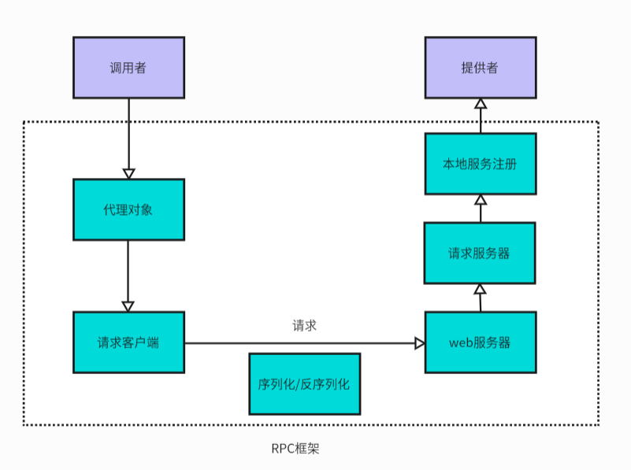

# 基于Etcd的RPC框架
> 作者：林语
## 项目简介

基于Java + Etcd + 自定义协议实现。
开发者可以引入Spring Boot Starter，通过注解和配置文件快速使用框架，像调用本地方法一样轻松调用远程服务；还支持通过SPI机制动态扩展序列化器。

## RPC框架

## 技术选型

- Vert.x框架
- Etcd 云原生存储中间件
- SPI机制
- 多种序列化器
  - JSON序列化
  - Kryo序列化
  - Hessian序列化
- 多种设计模式
  - 单例模式
  - 工厂模式
  - 代理模式
- Spring Boot Starter开发
- 反射和注解驱动
- Hutool、Lombok工具库